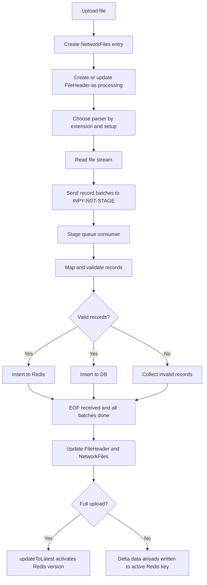

# Network Directory File Upload Flow

This document explains how a Network Directory file upload moves from the upload API to queues, Redis, and the database. It is written for someone new to this service, so it starts with the big picture and then explains the Redis pipeline and Lua scripts in detail.

## 1. One-Line Summary

When a file is uploaded, the service records the file in `NetworkFiles` and `FileHeader`, reads the file in batches, sends records to a stage queue, validates and maps each batch, writes valid records to Redis and the database, then marks the file complete or failed. For full uploads, Redis data is first written under a versioned temporary key and becomes live only when `FileHeader.updateToLatest` renames the versioned key to the active key.

## 2. Important Concepts

### Network Directory Type

The Network Directory type, or ND type, is the business file type being uploaded. Examples are `RT1APSP`, `SSI`, `MODULUS`, `SWIFT_BICPLUS`, and similar values.

In folder names and queue payloads you will see values like:

```text
ND-RT1APSP-FULLUPLOAD
```

Here:

- `RT1APSP` is the ND type.
- `FULLUPLOAD` means the file is a full replacement load.
- Partial or delta uploads are handled differently from full uploads.

### Upload Version

`uploadVersion` is the version number for a full upload. It lets the system load a new version without disturbing the currently active Redis key.

For example, during a full upload for `RT1APSP` version `9`, Redis writes records into a temporary versioned key:

```text
{OEPYND::RT1APSP}9
```

After the file completes and record counts match, the versioned key is renamed to the live key:

```text
OEPYND::RT1APSP
```

This is important because consumers should not read half-loaded full-upload data.

### FileHeader Status

`FileHeader` tracks the processing lifecycle of the file.

Common statuses used in this flow:

- `P`: processing
- `C`: upload complete, ready to be activated for full uploads
- `A`: active, used for delta uploads or after activation
- `F`: failed
- future-dated status: used when the file should not immediately affect Redis

### NetworkFiles Status

`NetworkFiles` tracks the uploaded physical file and is updated to success or failure once processing completes.

## 3. End-to-End Flow



## 4. Upload Entry Point

The upload starts from the container model.

Relevant code:

- `common/models/container.js`
- `common/models/NetworkFiles.js`
- `lib/parseToJson.js`

The API `uploadFileForApproval` accepts the file and places it in a triage folder. After approval, `moveFileToContainer` moves it into the actual ND folder/container.

For a folder such as:

```text
ND-RT1APSP-FULLUPLOAD
```

the file is eventually processed as ND type `RT1APSP` with full-upload mode.

The service creates a `NetworkFiles` record through `NetworkFiles.insertFileInfo`. That record contains values such as:

- `nfPath`: file path
- `nfFileName`: uploaded file name
- `nfStatus`: initially `READY`
- `nfFtsFrnId`: file type setup foreign key
- `ftsFileType`: ND type
- `fullUpload`: whether it is a full upload
- `containerName`: source container/folder

Then `parseToJson.validateFile` creates or updates the matching `FileHeader` entry. This is where the file begins its processing lifecycle.

Example `FileHeader` fields:

```js
{
  fileName: 'RT1APSP_Full.txt',
  uploadType: 'F',
  uploadFileType: 'RT1APSP',
  failureCount: 0,
  fileStatus: 'P',
  uploadVersion: 9,
  fileIdentifier: '...',
  _type: 'FileHeader'
}
```

## 5. Parser Selection

`lib/parseToJson.js` selects the parser based on the file extension and file type setup:

- fixed-length files: `lib/parseFixedLength.js`
- `.csv`, `.tsv`, `.t`: `lib/parseCsv.js`
- `.txt` with delimited config: `lib/parseDelimited.js`
- `.txt` without delimited config: `lib/parseCsv.js`
- `.xlsx`: `lib/parseXls.js`
- `.xml`: `lib/parseXml.js`

Most parser implementations now use the stage queue pattern: they read raw records, create batches, send the batches to `INPY-NDT-STAGE`, and finally send an EOF message.

`parseDelimited.js` still contains a direct streaming insert path where it validates and inserts batches without the stage queue. When debugging `.txt` files with delimited configuration, check this file because it may bypass the staged flow.

## 6. Stage Queue

Relevant code:

- `lib/stageRecordInQueue.js`
- `lib/stageQueueConsumer.js`

The stage queue name is controlled by:

```text
MQ_NETWORK_STAGE_QUEUE
```

If the environment variable is not set, the default queue is:

```text
INPY-NDT-STAGE
```

### Batch Message

Parsers send batch messages like this:

```js
{
  type: 'batch',
  fileDetails,
  records,
  count,
  ndType,
  uploadVersion
}
```

### EOF Message

After the parser finishes reading the file, it sends:

```js
{
  type: 'eof',
  fileDetails,
  ndType,
  uploadVersion
}
```

EOF tells the consumer: no more batches will arrive for this file. The consumer finalizes the file only after both conditions are true:

- EOF has been received.
- All known batches have finished processing.

This prevents the file from being marked complete while some batch is still being inserted.

## 7. Stage Queue Consumer Processing

`lib/stageQueueConsumer.js` consumes `INPY-NDT-STAGE`.

For each batch it does the following:

1. Builds a file key from `nfId` and `uploadVersion`.
2. Tracks processing state in memory using `fileProcessingState`.
3. Loads mapper configuration for the ND type.
4. Applies JSONata mapping if configured.
5. Applies pre-save conditions if configured.
6. For delta uploads, assigns `ndDeltaUploadAction` as upsert or delete.
7. Validates mandatory and primary key values.
8. Sends valid records to `insertToRedisAndDb`.
9. Stores invalid records for the error file.

You will see logs similar to:

```text
Processing batch for file: RT1APSP_Full.txt, records: 111
Batch processed for file: RT1APSP_Full.txt, batch: 1/1
```

## 8. Insert to Redis and DB

Relevant code:

- `lib/recordsHandler.js`
- `lib/insertToRedis.js`
- `lib/insertToModel.js`
- `lib/parserUtils.js`
- `lib/redis/redisPipeline.js`

`insertToRedisAndDb` is the main fan-out function.

It does:

```js
await insertToRedis(data, fileDetails);
await insertToModel.insertToModel(data, fileDetails, primaryKeys, colConfig);
```

There is one important exception: if the file is future-dated, Redis insert is skipped at this stage. The records are inserted into DB, and Redis activation happens later according to the future-dated file process.

### Model-Specific Redis Enrichment

Before generic Redis upload, `lib/insertToRedis.js` checks whether the target model has a `redisEnricher` function:

```js
if (model.redisEnricher) {
  result = await model.redisEnricher(data, fileDetails);
}
```

If no model-specific enricher exists, the records go directly to `parserUtil.uploadToRedis`, which calls the Redis pipeline.

If a model-specific enricher exists, it can transform the data into a Redis-specific shape or write to Redis itself. SSI and Modulus use this mechanism.

## 9. Generic Redis Pipeline

Relevant code:

- `lib/redis/redisPipeline.js`
- `lib/redis/redisKey.js`
- `lib/redis/uniqueKeys.js`

A Redis pipeline batches many Redis commands and sends them to Redis together. Without a pipeline, every `hset` or `sadd` would be a separate network round trip. With a pipeline, the code can queue hundreds or thousands of commands in memory and execute them as one batch.

This improves upload performance because file uploads usually contain many records.

### Full Upload Redis Flow

For full uploads, `handleFullUploadToRedis` writes to a versioned temporary hash key:

```text
{OEPYND::<ND_TYPE>}<uploadVersion>
```

Example:

```text
{OEPYND::RT1APSP}9
```

For each valid record:

1. Determine the Redis hash field key.
2. Serialize the record as JSON.
3. Queue an `hset` command in the pipeline.
4. Build unique search keys if required.
5. Queue unique-key commands.
6. Execute the pipeline every `BATCH_SIZE` records.

Conceptually:

```js
pipeline.hset(
  `{OEPYND::${transactionType}}${uploadVersion}`,
  recordKey,
  JSON.stringify(record)
);
```

The full-upload key is intentionally not the active key yet. It is temporary until activation.

### Delta Upload Redis Flow

For delta uploads, `handleDeltaUploadToRedis` writes directly to the active Redis hash:

```text
OEPYND::<ND_TYPE>
```

For additions and modifications:

```js
pipeline.hset(
  `OEPYND::${transactionType}`,
  recordKey,
  JSON.stringify(record)
);
```

For deletions:

```js
pipeline.hdel(
  `OEPYND::${transactionType}`,
  recordKey
);
```

Delta uploads do not wait for `renameRedisKeyToFileType`, because they are applying changes to the already-active dataset.

### Chunking

The pipeline is executed in chunks:

```js
if ((index > 0 && index % chunkSize === 0) || index === dataLength - 1) {
  await pipeline.exec();
  await execUniqueKeyPipeline(uniqueKeyPipeline);
}
```

Both the main Redis pipeline and, when present, the unique-key pipeline are executed at the chunk boundary. Chunking is used to avoid holding too many commands in memory. It is a balance:

- Bigger chunks reduce Redis round trips.
- Smaller chunks reduce heap pressure.

The chunk size comes from `constants.BATCH_SIZE`. In the current full-upload code, each executed chunk also writes this console message:

```text
**exec** BATCH ADDED <ND_TYPE>
```

### Unique Search Keys

During Redis insert, the service also maintains unique search keys using `getUniqueSearchKeys`.

For full upload, unique-key updates are queued only when mapped unique keys exist:

```js
if (mappedUniqueKeys?.length) {
  updateUniqueSearchKeys(...);
}
```

For delta upload, unique-key updates are queued when `getUniqueSearchKeys` returns a truthy value.

Two Redis structures are used:

- Normal unique keys are stored with `hset`.
- Multi-record unique keys are stored with `sadd`.

For full upload, normal unique keys are written under a versioned key:

```text
{OEPYND_UNQKEY::<ND_TYPE>}<uploadVersion>
```

For delta upload, normal unique keys are written under the active key:

```text
OEPYND_UNQKEY::<ND_TYPE>
```

Multi-record unique keys include the unique key name and upload version.

### Redis Cluster and Enterprise Redis Hash Tags

The code uses Redis hash tags with braces, for example:

```text
{OEPYND::RT1APSP}9
```

In Redis Cluster, keys with the same text inside `{}` are placed in the same hash slot. This matters because commands like rename, pipeline patterns, or multi-key behavior are safer when related keys are colocated.

When either of these is enabled:

```text
ENT_REDIS_WITH_CLUSTER=true
REDIS_CLUSTER_NODES=<value>
```

the code creates a separate pipeline for unique keys. `ENT_REDIS_WITH_CLUSTER` must be exactly the string `true`; `REDIS_CLUSTER_NODES` only needs to be present with a truthy value. This keeps the main data writes and unique-key writes organized for Redis Enterprise with cluster behavior or plain Redis Cluster behavior.

## 10. Redis Activation for Full Uploads

Full upload data becomes live through `FileHeader.updateToLatest`.

Relevant code:

- `common/models/FileHeader.js`
- `lib/redis/redisPipeline.js`

The activation step does this:

1. Reads version details from Redis for the ND type.
2. Checks whether there is a `toBeActive` version.
3. Calls `FileHeader.checkForCompletion`.
4. Compares total file records, DB records, and failure counts.
5. Marks the `FileHeader` active.
6. Updates version details in Redis.
7. Renames the versioned Redis key to the active Redis key.
8. Purges older Redis keys and old DB records.

The actual Redis rename is done by `renameRedisKeyToFileType`.

For data:

```text
{OEPYND::RT1APSP}9 -> OEPYND::RT1APSP
```

For unique keys:

```text
{OEPYND_UNQKEY::RT1APSP}9 -> OEPYND_UNQKEY::RT1APSP
```

This rename is the moment the newly uploaded full file becomes the active Redis data.

## 11. Lua Scripts

Lua scripts are small scripts executed inside Redis using the `EVAL` command. In this repo, they are used when a model needs Redis operations that are better handled atomically or with custom data-structure logic.

Relevant code:

- `common/models/StandingSttlmInstr/StandingSttlmInstr.js`
- `common/models/StandingSttlmInstr/ssiInsert.lua`
- `common/models/Modulus/Modulus.js`

### Why Use Lua in Redis?

Redis executes a Lua script atomically. That means Redis runs the whole script as one uninterrupted operation.

Advantages:

- Avoids race conditions for read-modify-write logic.
- Reduces multiple client round trips into one Redis call.
- Keeps complex Redis update logic close to the data.
- Lets the script inspect existing Redis data, transform it, and write it back safely.
- Useful when command order matters and another request should not change the key midway.

Lua is especially useful when the operation is not just `hset field value`, but:

- read current value,
- decode it,
- merge or reorder records,
- write the updated value back.

### SSI Lua Script

SSI has a special Redis format. One SSI input record may create multiple Redis map keys because `assetCategories` can contain comma-separated values.

The model has this feature flag:

```text
REDIS_INSERTION_USING_LUA=TRUE
```

When this is true, `SSI.redisEnricher` calls `formDataForRedisInsertViaFileUpload`, which calls `executeLuaScript`, which loads and executes:

```text
common/models/StandingSttlmInstr/ssiInsert.lua
```

The Lua script receives:

- `KEYS[1]`: Redis hash key, for example `{OEPYND::SSI}9`
- `ARGV[1]`: map key, for example `BIC:CCY:ASSET_CATEGORY`
- `ARGV[2]`: BIC account holding institution
- `ARGV[3]`: metadata JSON containing start and stop timestamps
- `ARGV[4]`: priority order, one of `PC`, `C`, `PI`, `I`

The value format stored inside the Redis hash field is:

```text
<bicAcctHldnInstitn>#<priorityOrder>$<metadataJson>
```

The script stores a JSON array of these values under one Redis hash field.

What the script does:

1. Builds the new record string.
2. Tries `HSETNX` first.
3. If the field does not exist, it creates the field with a one-item JSON array.
4. If the field already exists, it reads the existing value using `HGET`.
5. Decodes the existing JSON array.
6. Replaces the existing entry if the same BIC already exists.
7. Otherwise inserts the new entry according to priority.
8. Writes the updated JSON array back with `HSET`.

Priority order is:

```text
PC > C > PI > I
```

This means `PC` entries are placed before `C`, `PI`, and `I`; `C` comes before `PI` and `I`; and so on.

Why Lua is useful here:

- Without Lua, JavaScript would need to `HGET`, parse, merge, sort, and `HSET`.
- Two uploads or API calls could read the same old value and overwrite each other.
- The Lua script makes the merge and write one atomic Redis operation.

Important behavior in this code path:

- When `REDIS_INSERTION_USING_LUA=TRUE`, `SSI.redisEnricher` returns `{ REDIS_INSERTION_USING_LUA: true }`.
- `lib/insertToRedis.js` sees that flag and returns early.
- That means generic `parserUtil.uploadToRedis` is skipped because Redis was already handled by the Lua path.

### SSI Without Lua

If `REDIS_INSERTION_USING_LUA` is not true, SSI still uses `redisEnricher`, but it builds a JavaScript object in memory and then lets the generic Redis upload pipeline write the result.

So SSI has two possible modes:

- Lua mode: SSI writes to Redis inside `redisEnricher`, then generic Redis upload is skipped.
- Non-Lua mode: SSI transforms records in `redisEnricher`, then generic Redis pipeline writes them.

### Modulus Lua Scripts

`common/models/Modulus/Modulus.js` defines Lua scripts inline.

The first script does an atomic hash set for `MODULUS_WEIGHTS` backward compatibility:

```lua
redis.call('hset', KEYS[1], ARGV[1], ARGV[2])
return 'OK'
```

The second script writes Modulus master data into a sorted set:

```lua
redis.call('zadd', KEYS[1], tonumber(ARGV[1]), ARGV[2])
return tonumber(ARGV[1])
```

For file uploads, Modulus `redisEnricher` processes each record and calls `insertModulusRedisRecord`. That writes to a versioned sorted-set key:

```text
{OEPYND::MODULUSMASTERDATA}<uploadVersion>
```

The sorted set score is `fromSortCode`, and the member value is built from:

```text
fromSortCode#ToSortCode#ModulusMethod#sequence
```

The `sequence` helps differentiate records that could otherwise produce similar values.

When `MODULUS_WEIGHTS` is activated, `FileHeader.updateToLatest` also renames the `MODULUSMASTERDATA` versioned Redis key to the active key.

## 12. Database Insert

Redis insert is not the only output. Valid records also go to DB through `lib/insertToModel.js`.

The DB record ID is generated using the Redis save key, transaction type, and upload version. Conceptually:

```text
<primary-key-derived-redis-save-key>::<ND_TYPE>::<uploadVersion>
```

This helps keep records version-aware in DB as well.

The DB insert is sent to the relevant LoopBack model, such as `NetworkParticipant`, `StandingSttlmInstr`, or another configured transaction model. For full uploads, `insertToModel` enriches each record, generates the version-aware ID, and calls `pushToBulkQ`.

`pushToBulkQ` sends the record to a model-specific bulk insert queue using this format:

```text
<pyAppName>-<MODEL_NAME>-DB-INSERT
```

So if `pyAppName` is `OEPYND` and the model is `NetworkParticipant`, the queue becomes:

```text
OEPYND-NETWORKPARTICIPANT-DB-INSERT
```

If DB insert fails, failed records are sent to a matching error queue:

```text
<pyAppName>-<MODEL_NAME>-DB-INSERT-ERROR
```

## 13. Finalization

When EOF has arrived and all batches are processed, `stageQueueConsumer.finalizeFile` decides the file outcome.

Failure case:

- critical batch error, or
- only invalid records and no valid data

The service sets:

- `FileHeader.fileStatus = F`
- `NetworkFiles.nfStatus = FAILURE`
- creates an error file if invalid records exist

Success case:

- future-dated file: future-dated status
- delta upload: active status
- full upload: complete status

It also stores:

- total records read
- failure count
- error file for partial invalid data, if needed

For full upload, status complete does not automatically mean live Redis data. The full upload becomes active only when `updateToLatest` succeeds.

## 14. Full Upload vs Delta Upload

### Full Upload

Use full upload when a file represents the complete dataset for an ND type.

Redis behavior:

- Writes to versioned key.
- Keeps current active key unchanged during loading.
- Activates by renaming the versioned key after completion.
- Old Redis keys and old DB records are purged after activation.

Example:

```text
During load: {OEPYND::RT1APSP}9
After activation: OEPYND::RT1APSP
```

### Delta Upload

Use delta upload when a file contains additions, modifications, or deletions.

Redis behavior:

- Writes directly to active key.
- Uses `hset` for additions and modifications.
- Uses `hdel` for deletions.
- Does not need versioned-key rename.

Example:

```text
Active key: OEPYND::RT1APSP
```

## 15. Beginner-Friendly Debugging Checklist

When debugging a file upload, check these points in order:

1. Was a `NetworkFiles` record created?
   - Check `nfStatus`, `nfFtsFrnId`, `ftsFileType`, `nfFileName`, and `fullUpload`.

2. Was a `FileHeader` record created?
   - Check `fileName`, `uploadType`, `uploadFileType`, `fileStatus`, and `uploadVersion`.

3. Did the correct parser run?
   - Check `parseToJson.validateFile` and the file extension.

4. Were batches sent to stage queue?
   - Look for logs from `stageRecordInQueue`.
   - Queue name defaults to `INPY-NDT-STAGE`.

5. Did the stage consumer process the batches?
   - Look for `Processing batch for file...` logs.

6. Were records rejected during validation?
   - Check mandatory and primary key columns.
   - Check generated error files.

7. Did Redis insert happen?
   - For future-dated files, Redis is intentionally skipped at this point.
   - For SSI, check whether `REDIS_INSERTION_USING_LUA` is enabled.
   - For Modulus, check the model-specific Lua path.

8. Did DB insert happen?
   - Check `insertToModel` logs and DB record counts.

9. Did EOF arrive?
   - Without EOF, the stage consumer will not finalize the file.

10. For full uploads, was `updateToLatest` called?
    - File processing can complete before the Redis version becomes active.

## 16. Key Files to Read

- `common/models/container.js`: upload and approval movement
- `common/models/NetworkFiles.js`: creates and updates uploaded-file metadata
- `common/models/FileHeader.js`: file lifecycle, completion checks, version activation
- `lib/parseToJson.js`: parser selection
- `lib/parseCsv.js`: staged CSV reading
- `lib/parseXls.js`: staged XLSX reading
- `lib/parseXml.js`: staged XML reading
- `lib/parseFixedLength.js`: staged fixed-length reading
- `lib/parseDelimited.js`: direct delimited insert path
- `lib/stageRecordInQueue.js`: sends batch and EOF messages
- `lib/stageQueueConsumer.js`: consumes batches and finalizes files
- `lib/recordsHandler.js`: writes valid records to Redis and DB
- `lib/insertToRedis.js`: model-specific Redis enrichment and generic Redis upload dispatch
- `lib/parserUtils.js`: chooses full or delta Redis upload
- `lib/redis/redisPipeline.js`: generic Redis pipeline implementation
- `common/models/StandingSttlmInstr/ssiInsert.lua`: SSI Redis merge script
- `common/models/Modulus/Modulus.js`: Modulus Redis Lua scripts

## 17. Quick Mental Model

Think of full upload as preparing a new Redis dataset beside the current one:

```text
Current live data: OEPYND::RT1APSP
New loading data: {OEPYND::RT1APSP}9
```

Only after the file and DB counts are correct does the system switch the new data into place:

```text
{OEPYND::RT1APSP}9 becomes OEPYND::RT1APSP
```

Think of delta upload as editing the current live dataset directly:

```text
OEPYND::RT1APSP gets hset or hdel commands immediately
```

Think of Lua scripts as Redis-side helpers for special cases where one record update needs logic, ordering, or read-modify-write safety that a simple pipeline command cannot provide.